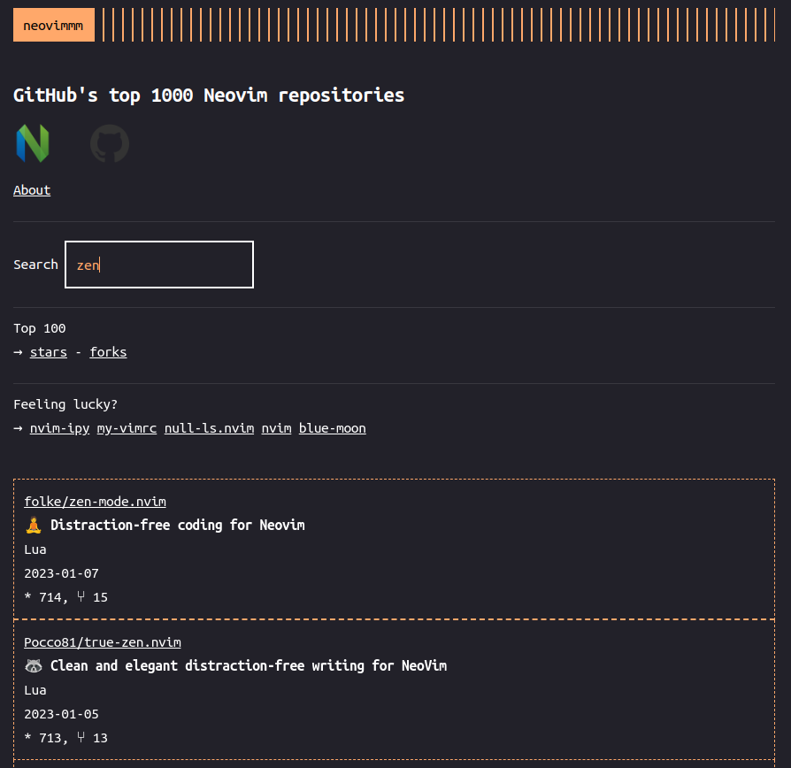

## neovimmm

[neovimmm](https://tomdeneire.github.io/neovimmm) is a browsing tool that let's you explore GitHub's top 1000 Neovim repositories.

More information at [https://github.com/TomDeneire/neovimmm#readme](https://github.com/TomDeneire/neovimmm#readme)
